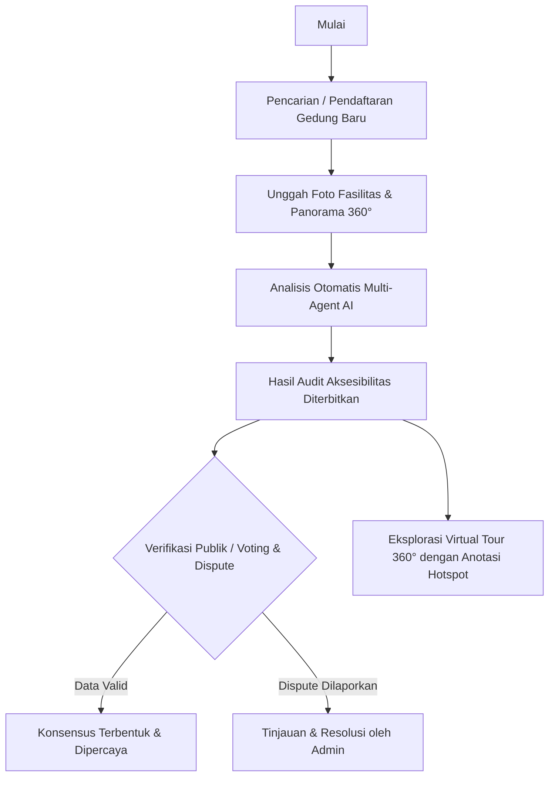

# Aksesibel - Sistem Audit Aksesibilitas Gedung Ramah Disabilitas

[](https://aksesibel-amcc.vercel.app/)
[](https://nextjs.org/)
[](https://fastapi.tiangolo.com/)
[](https://supabase.com/)
[](https://langchain-ai.github.io/langgraph/)

**Aksesibel** adalah platform berbasis web interaktif yang dirancang untuk memetakan, mengaudit, dan memvisualisasikan aksesibilitas fasilitas gedung bagi penyandang disabilitas di Indonesia. Standar audit yang digunakan mengikat dan berpatokan resmi pada **Permen PUPR No. 14/2017 tentang Persyaratan Kemudahan Bangunan Gedung** dan **PP No. 42/2020**.

---

## 🌐 Akses Situs

Aplikasi web ini telah dideploy dan dapat diakses secara langsung melalui tautan berikut:
 **[https://aksesibel-amcc.vercel.app/](https://aksesibel-amcc.vercel.app/)**

---

## 🔑 Informasi Login & Akses Kredensial

### 👤 Pengguna Biasa (Kontributor / Auditor Publik)
Untuk masuk ke sistem sebagai pengguna umum (bisa mengajukan audit baru, memberikan suara/voting, atau mendaftarkan kunci API Developer):
* **Metode Login**: Gunakan tombol **Masuk dengan Google** pada halaman login utama.

### 👑 Halaman Dashboard Admin
Untuk mengakses panel administrator (mengelola kriteria audit, meninjau perselisihan data / *disputes*, mengaudit kunci pengembang):
* **URL Halaman Admin**: `/admin/login` (atau akses langsung ke [https://aksesibel-amcc.vercel.app/admin/login](https://aksesibel-amcc.vercel.app/admin/login))
* **Email**: `admin@aksesibel.id`
* **Password**: `admin_aksesibel_2026`

---

## 🛠️ Stack Teknologi

Platform Aksesibel dikembangkan dengan arsitektur modern berkinerja tinggi:

* **Frontend**: Next.js 16 (App Router), Tailwind CSS (untuk styling adaptif & modern), Framer Motion (untuk animasi mikro), Leaflet.js & React Leaflet (untuk peta lokasi gedung), dan Pannellum React (untuk penampil virtual tour 360°).
* **Backend**: FastAPI (Python 3.10+), Supabase Python SDK (untuk berinteraksi dengan database Postgres dan media storage).
* **Multi-Agent AI Pipeline**: Ditenagai oleh **LangGraph** dan model LLM **Groq** dan **Google Gemini**, terdiri dari tiga agen khusus:
  1. **Text Agent**: Menganalisis potensi aksesibilitas dasar lewat nama & alamat gedung.
  2. **Visual Agent**: Mengidentifikasi kriteria pemenuhan fisik berdasarkan bukti foto yang diunggah.
  3. **Resolver Agent**: Mengonsolidasikan hasil analisis, menyelesaikan kriteria bernilai *unknown*, serta menentukan kesimpulan konsensus akhir.

---

## 🔄 Alur Penggunaan Utama (Core User Workflow)



1. **Pendaftaran Gedung**: Pengguna mencari gedung atau menambahkan gedung baru dengan menentukan koordinat peta secara tepat menggunakan *pin drop map* interaktif.
2. **Unggah Bukti Fasilitas**: Pengguna mengunggah foto-foto area akses (pintu masuk, toilet, tangga, parkir) atau panorama 360° equirectangular.
3. **Audit Multi-Agent AI**: Begitu foto diunggah, pipeline AI menganalisis gambar untuk mencocokkan dengan kriteria resmi (seperti ketersediaan ramp dengan kemiringan maksimal 8°, lebar pintu masuk minimal 90cm, ubin pemandu tuna netra, alarm strobo tuna rungu, dll.).
4. **Halaman Hasil Audit**: Hasil audit menunjukkan status kriteria (*Met*, *Not Met*, *Unknown*, *Not Applicable*) lengkap dengan alasan penalaran faktual dari AI.
5. **Sistem Kepercayaan & Voting**: Pengguna lain dapat memberikan *Upvote* jika setuju atau mengajukan *Dispute* jika menemukan kondisi gedung berbeda dengan hasil AI.
6. **Virtual Tour Interaktif**: Pengguna dapat melihat tur virtual 360° di mana terdapat anotasi titik panas (*hotspot annotations*) visual yang dipasang langsung di atas objek fasilitas disabilitas.
7. **Developer Portal**: Pengembang dapat membuat API Key untuk mengambil data audit gedung ini secara real-time guna diintegrasikan dengan aplikasi navigasi atau peta eksternal lainnya.

---

## 📦 Menjalankan Sistem Secara Lokal

### Prasyarat
* Node.js v18 atau v20+
* Python 3.10 atau lebih baru
* Akun/Proyek Supabase (Database & Storage bucket untuk `scenes` dan `photos`)
* API Key untuk Groq & Google OAuth client credentials

### Langkah 1: Setup Backend (FastAPI)
1. Masuk ke direktori backend:
   ```bash
   cd backend
   ```
2. Buat environment virtual dan aktifkan:
   ```bash
   python -m venv .venv
   # Windows
   .venv\Scripts\activate
   # Linux/macOS
   source .venv/bin/activate
   ```
3. Install dependensi:
   ```bash
   pip install -r requirements.txt
   ```
4. Buat file `.env` di dalam folder `backend/` dan sesuaikan nilainya dengan template berikut:
   ```env
   SUPABASE_URL=https://<id-supabase-anda>.supabase.co
   SUPABASE_SERVICE_KEY=<service-role-key-anda>
   GEMINI_API_KEY=<api-key-gemini>
   GROQ_API_KEY=<api-key-groq>
   ```
5. Jalankan backend server:
   ```bash
   uvicorn main:app --reload
   ```

### Langkah 2: Setup Frontend (Next.js)
1. Masuk ke direktori frontend:
   ```bash
   cd ../frontend
   ```
2. Install dependensi NPM:
   ```bash
   npm install
   ```
3. Buat file `.env.local` di dalam folder `frontend/` dan isi konfigurasinya:
   ```env
   NEXT_PUBLIC_BACKEND_URL=http://localhost:8000
   NEXT_PUBLIC_SUPABASE_URL=https://<id-supabase-anda>.supabase.co
   NEXT_PUBLIC_SUPABASE_ANON_KEY=<anon-key-supabase>
   ```
4. Jalankan frontend dev server:
   ```bash
   npm run dev
   ```
5. Akses aplikasi lokal melalui `http://localhost:3000`.

---

## 🔍 Panduan Pemecahan Masalah (Troubleshooting)

### 1. 🛑 Login dengan Google Gagal atau Halaman Membeku
* **Penyebab**: Cookie pihak ketiga (third-party cookies) diblokir oleh setelan browser Anda (sering terjadi pada mode Incognito atau browser Brave).
* **Solusi**: Aktifkan izin cookie pihak ketiga untuk domain `https://aksesibel-amcc.vercel.app` dan Google OAuth domain di setelan browser Anda.
* **Lokal**: Pastikan Authorized Redirect URIs di Google Cloud Console Anda sudah menyertakan `http://localhost:3000` dan `http://localhost:3000/auth/callback`.

### 2. 🤖 Analisis AI Menghasilkan Status "Unknown" pada Semua Kriteria
* **Penyebab**: API Rate Limit (429) pada Groq API Key tercapai, atau token Groq Anda sedang habis batas kuotanya.
* **Solusi**: Sistem memiliki mekanisme retry backoff otomatis. Jika tetap gagal, silakan tunggu beberapa menit agar jendela rate limit Groq terreset, lalu coba jalankan ulang analisis pada gedung tersebut. Pastikan juga foto yang diunggah memiliki pencahayaan cukup dan menyoroti fasilitas secara jelas.

### 3. 🗺️ Peta Lokasi Gedung Tidak Muncul atau Kosong
* **Penyebab**: Kegagalan memuat modul Leaflet atau server tile OpenStreetMap diblokir oleh AdBlocker/DNS lokal Anda.
* **Solusi**: Periksa koneksi internet Anda dan nonaktifkan AdBlocker/uBlock Origin untuk platform Aksesibel sementara waktu.

### 4. 🌀 Tampilan Virtual Tour 360° Berwarna Hitam atau Mengalami Glitch
* **Penyebab**: Browser Anda tidak mengaktifkan akselerasi perangkat keras (WebGL) atau format gambar yang diunggah bukan gambar panorama bertipe *equirectangular* (rasio 2:1).
* **Solusi**: 
  1. Periksa dukungan WebGL di browser Anda melalui [webglreport.com](https://webglreport.com/).
  2. Pastikan akselerasi hardware aktif di setelan browser (Settings > System > Use graphics acceleration when available).
  3. Pastikan gambar yang diunggah merupakan hasil foto 360° yang valid, bukan foto landscape biasa.

---

*Dikembangkan dengan penuh dedikasi untuk mewujudkan kota-kota di Indonesia yang inklusif dan ramah disabilitas bagi semua orang.* 
